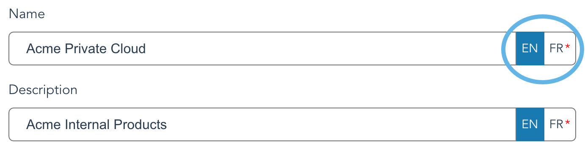

# Add a new product catalog

-   Must be logged in with Billing: Manage permission
-   Monetization must be enabled
-   Have at least one service connection configured

Monetization is configured from the **Administration** \> **Monetization** page.

1.  Click on the button labeled **Add product catalog**.

2.  Enter a name and a description for the product catalog.

    Note that if multiple languages have been enabled in the branding for this organization, a language selector will appear next to the **Name** and **Description** text boxes. Each product catalog must have a name and description for each of the enabled languages.

3.  Select which service connections to use for this product catalog.

        |**All connections of a specific service type**|Select one service type. This catalog will apply to all service connections of this service type.|
    |**Specific connection\(s\)**|Service connections are grouped by type. Select a type, then select one or more service connections.|

    A product catalog

4.  After selecting a service type, an empty list of products will appear. Click on the button labeled **Add category**, and type a name into the text field, followed by the Enter key to create your first product category.

    Each category in a product catalog will appear on customer invoices as a separate grouping of charges.

5.  You may now [add new products](create_a_product.md#) to your product catalog.

6.  After you have added one or more products, click **Submit** to save your new product catalog.

**Parent topic:**[Product catalog](product_catalog.md)

## Example for add a new product catalog

In this article, we will add a new product catalog for our organization, Acme Corporation. A service connection is already configured for our private cloud. We begin by navigating to the **Administration** \> **Monetization** page.

1.  Click on the button labeled **Add product catalog**.

2.  Enter `Acme Private Cloud` into the name field, and `Acme internal products` into the description field.

    Our organization has two languages enabled, so we will also enter the name and description for each of the enabled languages.

3.  Select **Specific connection\(s\)**, click on the **Service type** pop-up menu, then click on the **Service connection\(s\)** pop-up menu, and select **Acme Private Cloud** from the list.

4.  An empty list of products now appears. Click on the button labeled **Add category**, and type `Compute` into the text field, followed by the Enter key to create the product category.

5.  You may now [add new products](create_a_product.md#) to your product catalog.

6.  After Click **Submit** to save your new product catalog.

    CAUTION:

    You must click on the **Submit** button after adding your product\(s\), otherwise the product catalog will not be saved, and any new products will be lost.

-   A new product catalog, `Acme Private Cloud`, is listed on the **Monetization** page.
-   The product catalog will now be available when creating new pricings.
-   Organizations with a pricing package that uses this product catalog will have the `Compute` category appear on their invoices as a separate grouping of charges.

